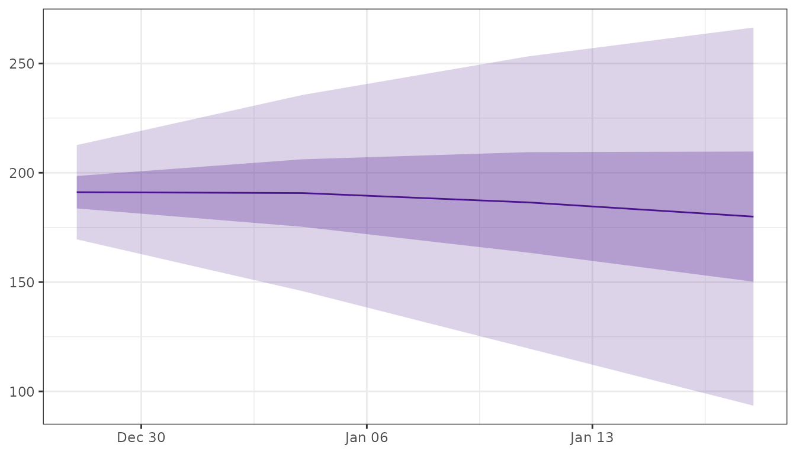
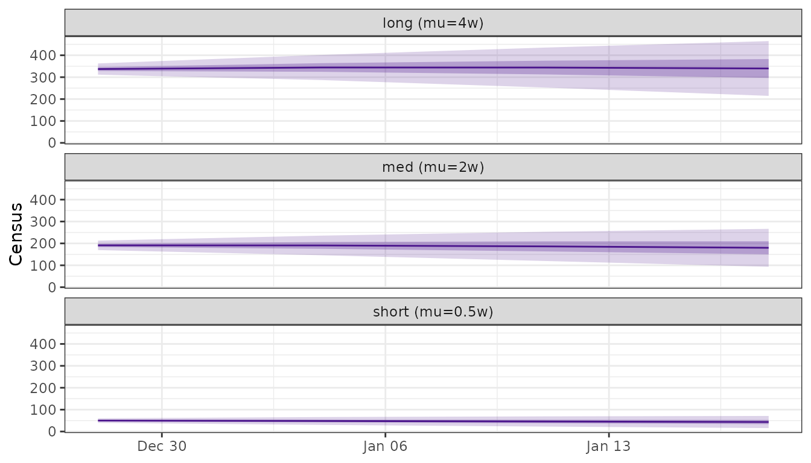
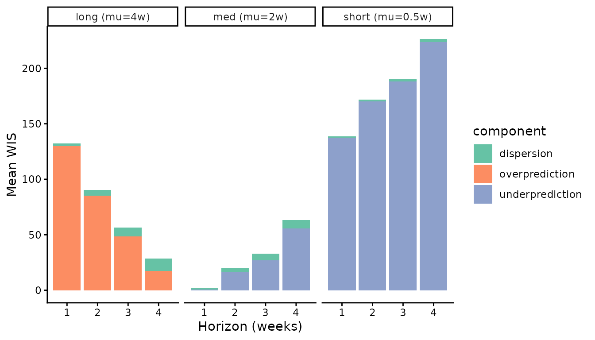

# Forecast hospital census from forecasting hubs

Public-health forecasting hubs (FluSight, COVIDhub, RSVhub) publish
**admission** forecasts. Hospital operations plan around the **census**,
the number of patients in hospital on a given day.

`censcast` transforms `hubverse` admission forecasts into census
forecasts by convolving them with a length-of-stay (LOS) distribution.
The result lands back in the hubverse quantile-forecast schema.

## The model

Let $`P(\text{LOS} > d)`$ be the probability that a patient is still in
hospital $`d`$ time-steps after admission. Today’s census is the sum of
past admissions, each weighted by their probability of still being here:

``` math
\text{census}(t) \;=\; \sum_{d \ge 0} \text{admissions}(t - d) \cdot
P(\text{LOS} > d).
```

## Pipeline

You bring three things, all in standard hubverse shape:

- an admission quantile forecast
  ([`hubData::collect_hub()`](https://hubverse-org.github.io/hubData/reference/collect_hub.html));
- observed admissions covering the `max_stay` window before the forecast
  ([`hubData::connect_target_timeseries()`](https://hubverse-org.github.io/hubData/reference/connect_target_timeseries.html));
- a LOS distribution
  ([`los_spec()`](https://accidda.github.io/censcast/reference/los_spec.md)).

In production, the first two come from a hub:

``` r

library(hubData)

admission_fc <- connect_hub(s3_bucket("cdcepi-flusight-forecast-hub")) |>
  dplyr::filter(target == "wk inc flu hosp",
                output_type == "quantile",
                model_id    == "FluSight-ensemble") |>
  collect_hub()

admission_hist <- connect_target_timeseries(
  s3_bucket("cdcepi-flusight-forecast-hub")
) |>
  dplyr::filter(target == "wk inc flu hosp") |>
  dplyr::collect()
```

For this vignette we use the toy datasets `flu_forecast` and
`flu_history` shipped with the package:

``` r

library(censcast)
library(dplyr)
library(purrr)
library(tidyr)
library(ggplot2)

los <- los_spec("negbin", mu = 2, k = 1.7, max_stay = 8)

census_fc <- fcast_census(flu_forecast, los, flu_history)
plot_fan(census_fc)
```



## Comparing LOS assumptions

Without ground-truth census, LOS is the dominant assumption. Run several
specs and compare:

``` r

los_specs <- list(
  "short (mu=0.5w)" = los_spec("negbin", mu = 0.5, k = 1.7, max_stay = 8),
  "med (mu=2w)"     = los_spec("negbin", mu = 2,   k = 1.7, max_stay = 8),
  "long (mu=4w)"    = los_spec("negbin", mu = 4,   k = 1.7, max_stay = 8)
)

census_runs <- imap(los_specs, \(los, name) {
  fcast_census(flu_forecast, los, flu_history) |> mutate(los = name)
}) |> bind_rows()

plot_fan(census_runs) +
  facet_wrap(~ los, ncol = 1)+
  labs( y = "Census")
```



[`plot_fan()`](https://accidda.github.io/censcast/reference/plot_fan.md)
treats any unrecognised column as a trajectory grouper, so the
user-added `los` column needs no configuration.

## Scoring

Hubverse hubs publish admissions truth, not census truth, so to score
you bring your own. It needs the standard hubverse target-data columns:
`target_end_date`, `target`, `location`, `observation`.

The demo below fakes one by convolving observed admissions with a “true”
LOS:

``` r

true_los <- los_spec("negbin", mu = 2, k = 1.7, max_stay = 8)

observed_census <- flu_history |>
  arrange(location, target_end_date) |>
  group_by(location) |>
  mutate(observation = stats::convolve(observation, rev(true_los),
                                       type = "open")[seq_along(observation)]) |>
  ungroup()

scores_by_los <- imap(los_specs, \(los, name) {
  fcast_census(flu_forecast, los, flu_history) |>
    score_census(truth = observed_census) |>
    mutate(los = name)
}) |> bind_rows()

scores_by_los |>
  summarise(across(c(overprediction, underprediction, dispersion), mean),
            .by = c(los, horizon)) |>
  pivot_longer(-c(los, horizon), names_to = "component", values_to = "wis") |>
  ggplot(aes(horizon, wis, fill = component)) +
  geom_col() +
  facet_wrap(~ los) +
  scale_fill_brewer(palette = "Set2") +
  labs(x = "Horizon (weeks)", y = "Mean WIS") +
  theme_classic()
```



## API

| Function | Role |
|----|----|
| [`los_spec()`](https://accidda.github.io/censcast/reference/los_spec.md) | Build a LOS survival vector. |
| [`fcast_census()`](https://accidda.github.io/censcast/reference/fcast_census.md) | Convolve hubverse admissions × LOS → hubverse census. |
| [`plot_fan()`](https://accidda.github.io/censcast/reference/plot_fan.md) | Quantile fan chart, returns a `ggplot`. |
| [`score_census()`](https://accidda.github.io/censcast/reference/score_census.md) | Score against observed census via `scoringutils`. |
