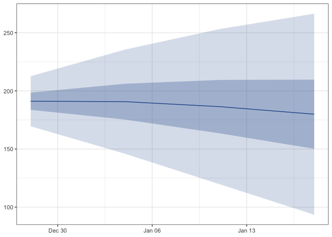

# censcast

Hospital **cens**us fore**cast**s from hubverse admission forecasts.

`censcast` convolves hubverse format admission quantile forecasts with a
length of stay (LOS) distribution to produce hubverse format census
quantile forecasts. Same schema in, same schema out.

``` R
census(t) = Σ_{d ≥ 0} admissions(t − d) · P(LOS > d)
```

where `d` is the lag in time steps since admission, and `P(LOS > d)` is
the probability a patient is still in hospital `d` steps after they
arrived.

## Example

``` r

library(censcast)

los <- spec_los("negbin", mu = 2, k = 1.7, max_stay = 8)
census_fcast <- fcast_census(admission_forecast, los, admission_history)

plot_fan(census_fcast)
```



`admission_forecast` and `admission_history` are toy datasets shipped
with the package. In real use, swap them for outputs from
[`hubData::connect_hub()`](https://hubverse-org.github.io/hubData/reference/connect_hub.html)
and
[`hubData::connect_target_timeseries()`](https://hubverse-org.github.io/hubData/reference/connect_target_timeseries.html).
See the vignette.

## API

| Function | Role |
|----|----|
| [`spec_los()`](https://accidda.github.io/censcast/reference/spec_los.md) | LOS survival vector from literature priors. |
| [`fit_los()`](https://accidda.github.io/censcast/reference/fit_los.md) | Fit LOS survival from observed `(admissions, census)`. |
| [`fcast_census()`](https://accidda.github.io/censcast/reference/fcast_census.md) | Convolve hubverse admissions × LOS → hubverse census. |
| [`plot_fan()`](https://accidda.github.io/censcast/reference/plot_fan.md) | Quantile fan chart, returns a `ggplot`. |
| [`score_census()`](https://accidda.github.io/censcast/reference/score_census.md) | Optional WIS via `scoringutils`. |
